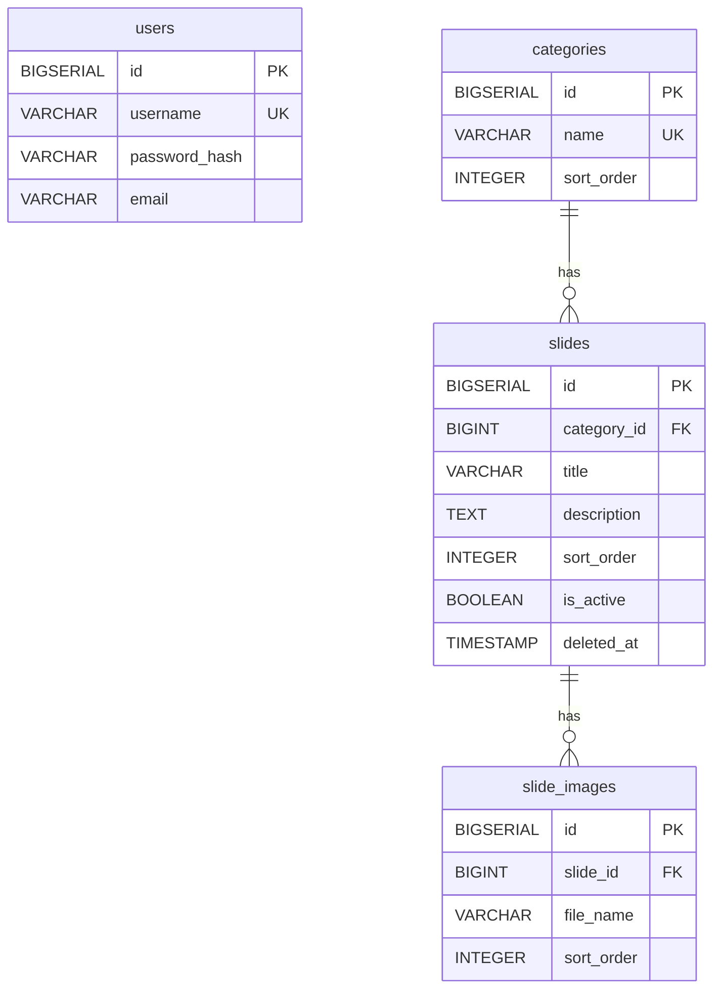

# Portfolio CMS

自作CMSを搭載した、自己紹介プレゼンテーションLP。
スライド形式のトップページに掲載するコンテンツ（テキスト・画像・カテゴリ）を、
認証付きの管理画面から CRUD 操作で更新できる、Spring Boot 製のフルスタックアプリ。

就職活動用ポートフォリオとして、**設計・実装・運用の3点を1人で通す**ことを目標に製作。

---

## なぜ作ったか

「動くだけのCRUDアプリ」ではなく、**実務で求められる以下の技術要素を網羅したアプリ**を1人で完成させ、未経験からのエンジニア転職でも「明日から手を動かせる」ことを示す目的で製作した。

1. **設計：** 4テーブル構成（User / Category / Slide / SlideImage）による1対多リレーションと正規化
2. **認証：** Spring Security + BCrypt + CSRF 対策
3. **マイグレーション：** Flyway でスキーマ + シード（7カテゴリ・19スライド）をコード管理
4. **テスト：** JUnit 5 + Mockito + MockMvc でService/Controller層をカバー（28テスト）
5. **CI：** GitHub Actions で push 時に自動テスト＋ビルド
6. **UI：** テンプレ感のない独自CSS（デザイン科卒 + DTP職業訓練の経験を反映）

---

## 画面

| 公開LP | 管理画面（一覧） | 管理画面（編集） |
|:---:|:---:|:---:|
|  |  |  |
| 黄金比をベースに設計したヒーロー（Blueprint Design）+ カテゴリ毎に整列したスライド | スライドを CRUD 操作で一元管理。カテゴリ・公開状態・表示順を直接編集 | Markdown 対応の説明文 + 画像複数アップロード + ヘルプチップで記法を案内 |

---

## 主な機能

### 公開画面
- カテゴリ別に整列したスライドを表示（`is_active = true` かつ `deleted_at IS NULL` のみ）
- 1スライドあたり複数画像対応
- **Markdown 対応の説明文**（commonmark-java で SSR 変換、`escapeHtml` で XSS 対策）
- レスポンシブ対応（PC / タブレット / スマホ）
- SEO / OGP / Favicon 完備

### 管理画面（認証必須）
- ログイン / ログアウト（Spring Security + BCrypt）
- スライドの一覧 / 新規登録 / 編集 / 論理削除
- カテゴリ選択・表示順指定・公開/非公開切替
- 画像の複数アップロード
- **Markdown 凡例ヘルプ**（テキストエリア下に記法チップを表示）

---

## 技術スタック

| レイヤ | 採用技術 | 選定理由 |
| :--- | :--- | :--- |
| 言語・FW | Java 17 (LTS) / Spring Boot 3.5 | 実務で広く使われる構成。LTS で長期安定 |
| テンプレート | Thymeleaf | SSR 型。SPA より初期コストが低く、CMS と相性が良い |
| 永続化 | Spring Data JPA / Hibernate | Repository パターンで CRUD を宣言的に記述 |
| DB | PostgreSQL 15 | 実務採用が多く、Flyway との相性も良い |
| マイグレーション | Flyway | SQL ネイティブ。スキーマをコード管理 |
| 認証 | Spring Security 6 / BCrypt | 業界標準。CSRF・認可ルールを宣言的に定義可能 |
| ビルド | Maven | 学習コストが低く、チーム開発で定着している |
| テスト | JUnit 5 / Mockito / MockMvc / AssertJ | Spring 公式 Starter 同梱。ユニット〜MVC まで同一で記述できる |
| CI | GitHub Actions | リポジトリに同居でき、Postgres サービスコンテナが使える |

---

## アーキテクチャ

### レイヤ構成

```
Controller  ← リクエスト/レスポンス、バリデーション、認可
    │
Service     ← トランザクション境界、ビジネスロジック
    │
Repository  ← JPA クエリ（Spring Data）
    │
Entity      ← DBテーブルと1:1対応
```

### ER図



- `slides` は **論理削除**（`deleted_at IS NULL` で判定）
- `slides.category_id` は `ON DELETE RESTRICT`（カテゴリ誤削除からスライドを守る）
- `slide_images.slide_id` は `ON DELETE CASCADE`（スライド削除時に画像も連動）
- 公開側のクエリは `idx_slides_active_sort` 部分インデックスで高速化

---

## デザインシステム

「動くだけのアプリ」ではなく**意図のある UI** を示すため、CSS を独自実装し、寸法・タイポ・余白すべてを **黄金比 φ = 1.618033988749895** から導出している。

### スケール（CSS 変数による一元管理）

| 種別 | トークン | 計算式 | 実値 |
|:---|:---|:---|:---|
| 余白 | `--s-1` ~ `--s-7` | φⁿ × 1rem | 0.382 / 0.618 / 1 / 1.618 / 2.618 / 4.236 / 6.854 rem |
| タイポ | `--fs-base` ~ `--fs-display` | φⁿ × 1rem | 1 / 1.618 / 2.058 / 2.618 / 4.236 rem |
| 行間 | `--lh-base` / `--lh-tight` | φ / (φ − 1/φ²) | 1.618 / 1.236 |
| コンテナ幅 | `--container-w` | Fibonacci 987 相当 | 61.8 rem (988.8 px) |
| 画像コンテナ | `aspect-ratio: φ:1` | — | 1.618 / 1 |

### 採用した 2026 年トレンド

| トレンド | 適用箇所 |
|:---|:---|
| **Blueprint Design** (Kittl, 2026) | ヒーローに φ 矩形 + 寸法線 + 黄金螺旋を SVG で図示 |
| **Resonant Stark** (Vistaprint, 2026) | ヒーロー lead を `font-weight: 300` で繊細化 |
| **Frosted Touch** (Vistaprint, 2026) | sticky ヘッダの `backdrop-filter` + カテゴリ区切り板 |
| **Light Skeuomorphism** (Vistaprint, 2026) | 全体に SVG noise の極微紙質感 |

---

## セットアップ

### 前提

- JDK 17（Temurin / OpenJDK）
- PostgreSQL 15+
- macOS / Linux（mvnw を使うため）

### 手順

```bash
# 1. DB 作成
createdb portfolio_cms

# 2. クローン & ディレクトリ移動
git clone <repo-url>
cd portfolio-cms

# 3. 環境変数（ローカル DB の認証情報）
export DB_USER=<your_pg_user>
export DB_PASSWORD=<your_pg_password>

# 4. 起動（Flyway が自動でマイグレーション + シード実行）
./mvnw spring-boot:run
```

初回起動時、空のDBに対し以下が自動投入される：

- **Flyway V3 / V4 シード：** 7カテゴリ（自己紹介 / 経歴 / 学習・スキル / 強み / ポートフォリオ / デザイン制作物 / 志望動機・今後）と、それに紐づく19スライド（公開LPに表示される本ポートフォリオの本文そのもの）。V4 ではデザイン制作物カテゴリと過去のデザイン作品スライドを追加
- **`DataInitializer`（Java側）：** 管理者アカウント1件（`admin` / `admin123`）

起動後：

| URL | 内容 |
|:---|:---|
| http://localhost:8080/ | 公開LP |
| http://localhost:8080/admin/login | 管理ログイン |

**初期管理者アカウント（開発用）：** `admin` / `admin123`
> 本番デプロイ前には必ず変更すること。

---

## テスト

```bash
./mvnw test
```

28 テスト（Service 19 + Controller 8 + Context load 1）。Service 層は Mockito / 純粋ユニットテスト、Controller 層は `@WebMvcTest` スライスで高速に実行される。`MarkdownService` は太字 / リンク / リスト / softbreak / `<script>` エスケープ / `null` 入力など計 10 ケースで境界条件を網羅。

---

## CI

`main` への push / PR で [GitHub Actions](.github/workflows/ci.yml) が以下を実行：

1. JDK 17 セットアップ + Maven キャッシュ
2. PostgreSQL 15 サービスコンテナ起動
3. `./mvnw test`（Flyway マイグレーション + 全テスト）
4. `./mvnw package -DskipTests`（JAR ビルド検証）
5. surefire レポートをアーティファクトとして保存

---

## ディレクトリ構成

```
portfolio-cms/
├── .github/workflows/ci.yml           # GitHub Actions
├── src/main/java/com/portfolio/cms/
│   ├── config/        # Security / WebMvc / 初期データ投入
│   ├── controller/    # 公開LP / 管理画面 / ログイン
│   ├── dto/           # フォームバインディング用
│   ├── entity/        # JPA エンティティ (4 テーブル)
│   ├── repository/    # Spring Data JPA
│   └── service/       # ビジネスロジック + ファイル保存
├── src/main/resources/
│   ├── db/migration/  # Flyway (V1 schema / V2 placeholder seed / V3 portfolio seed / V4 design works)
│   ├── static/css/    # 独自CSS
│   ├── static/works/  # 過去のデザイン制作物（実HTMLを丸ごとホスティング）
│   └── templates/     # Thymeleaf (layout / admin / public)
└── src/test/java/...  # JUnit 5 / Mockito / MockMvc
```

---

## 工夫した点

- **論理削除 + 部分インデックス：** `deleted_at IS NULL` 条件付きインデックスで、公開クエリに削除済みレコードを読ませない。
- **`open-in-view: false` + `JOIN FETCH`：** ビューでの遅延ロードを禁止し、リポジトリ層で `category` / `images` を明示的に先読み。N+1 と `LazyInitializationException` を構造的に排除。
- **シードまでコード管理：** Flyway V3 / V4 で公開LP本文（7カテゴリ・19スライド）まで投入。誰がチェックアウトしても `./mvnw spring-boot:run` 一発で同じ画面が再現できる。
- **過去のデザイン作品をライブホスティング：** 職業訓練で制作した HTML サイトを `src/main/resources/static/works/` 配下に同梱し、`/works/hiiragi/index.html` 等で実物にアクセス可能。スクリーンショットだけでなく**実装そのもの**を見せられる構成。
- **黄金比設計システム：** `:root` の CSS 変数で寸法・タイポ・余白を φ ベースで一元管理し、ヒーロー上に SVG で「設計図」として可視化。デザインの根拠を**数字で説明できる**設計に。
- **Markdown 対応 + XSS 対策：** スライド本文を `commonmark-java` で SSR 変換、`escapeHtml(true)` で生 HTML を遮断。管理画面では記法ヘルプを併記し、編集者と閲覧者の双方の体験を整えた。
- **テストスライスの最小化：** `@WebMvcTest` の `excludeFilters` で `WebMvcConfig`（ファイルストレージ依存）を外し、Controller 層テストを DB なし・数百ms で回せるように調整。
- **環境変数による設定外出し：** DB 資格情報・初期 admin パスワード・アップロードディレクトリすべて `${VAR:default}` 形式で外部化。`application-prod.yml` プロファイルで本番特有の設定（キャッシュ・ロギング・エラー詳細抑制）を分離。
- **独自CSS：** Bootstrap に依存せず、`:root` の CSS 変数でデザインシステムを一元化。デザイン科卒の強みを反映。

---

## デプロイ前チェックリスト

公開前に差し替えが必要な箇所:

| 場所 | 内容 |
|:---|:---|
| `src/main/resources/templates/layout/fragments.html` | フッタ `Contact` の `https://github.com/` と `mailto:contact@example.com` を実 URL に |
| 環境変数 `INITIAL_ADMIN_USERNAME` / `INITIAL_ADMIN_PASSWORD` | 強いパスワードを設定（未設定時は警告ログ + デフォルト `admin` / `admin123`） |
| 環境変数 `DB_URL` / `DB_USER` / `DB_PASSWORD` | 本番 PostgreSQL の接続情報 |
| 起動引数 | `SPRING_PROFILES_ACTIVE=prod` で本番プロファイル有効化 |
| 「最後に」スライド | 管理画面から GitHub リンクを差し込む（Markdown 記法対応済み） |

---

## 今後の計画

- [x] スライド本文の Markdown 対応（commonmark-java + XSS 対策）
- [x] 黄金比ベースのデザインシステム + 2026 年トレンド反映
- [x] 過去のデザイン作品（5 案件）を `デザイン制作物` カテゴリとして統合
- [x] SEO / OGP / Favicon
- [x] README へスクリーンショット追加
- [x] `application-prod.yml` プロファイル + 環境変数による設定外出し
- [ ] 本番デプロイ（OCI Always Free ARM → 保険で Render 無料枠）
- [ ] 画像ストレージを OCI Object Storage に移行（現在はローカル保存）
- [ ] Python (FastAPI) 版の移植 — Python 特化軸の補強として

---

## 作者

**吉田 颯汰**
デザイン科卒 / 通信販売7年 → Java・Python 職業訓練中（2026年）
