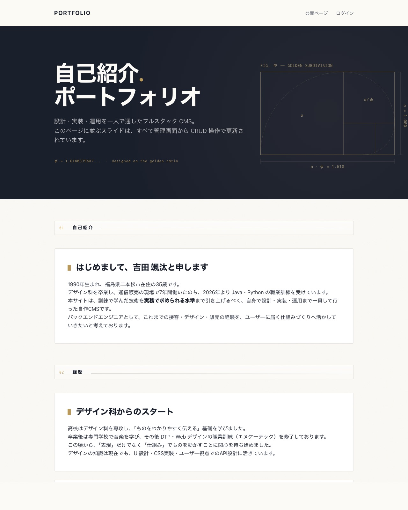
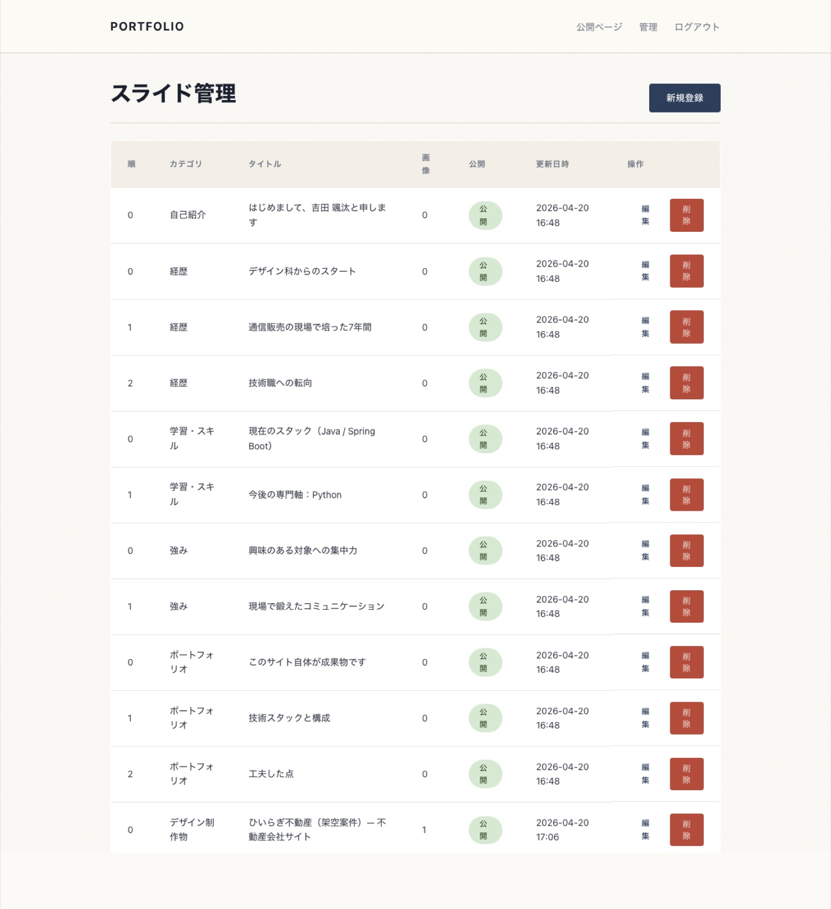
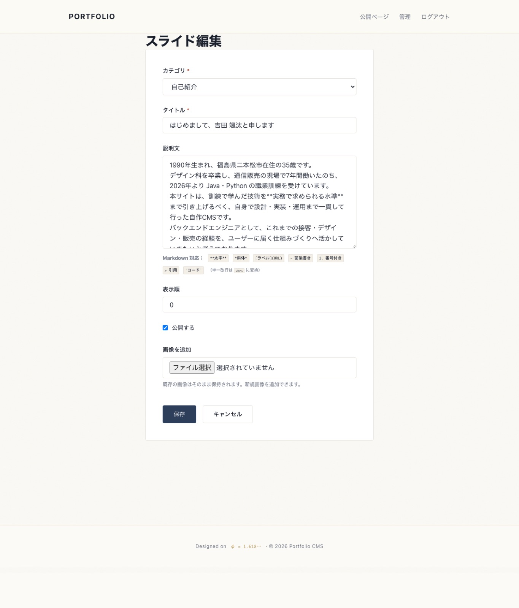
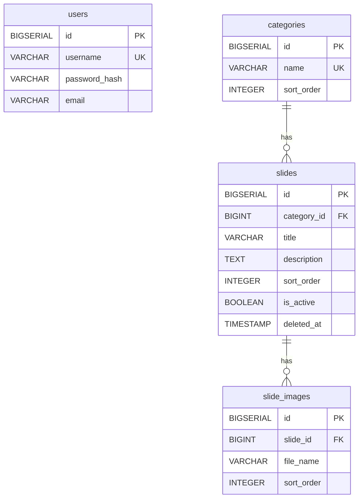

# Portfolio CMS

[](https://github.com/sct202601fukushima-sota-yoshida/portfolio-cms/actions/workflows/ci.yml)
[](https://portfolio-cms-cjr4.onrender.com)
[](docs/lighthouse/SUMMARY.md)
[](docs/lighthouse/SUMMARY.md)


**「全体の企画・計画」を得意とし、AI 時代の開発との相性の良さを軸にした**「複合的な技術者」志望の自己紹介ポートフォリオ。

Claude Code（AI コーディングエージェント）と協働して、**動くものを先に作り、必要な知識を逆算で学ぶ** —
その実例として、自己紹介サイト自体を Spring Boot 製のフルスタック CMS として一人で構築・運用しています。

本リポジトリ（自作 CMS）は **バックエンド設計力の実証**であり、加えて公開LP の「ポートフォリオ」セクションでは、**AI と協働して英語圏 B2B 向けに開発・本番公開した実 SaaS 2 本**（[VoxReply](https://voxreply.gladdot90s.workers.dev) / [Patchlog](https://patchlog.gladdot90s.workers.dev)）も作品として紹介しています。こちらは「慣れないスタックでも動いて公開できるプロダクトを作れる」ことの実証です（就職活動用に課金停止・全機能無料の作品版）。

🚀 **ライブ公開中:** [https://portfolio-cms-cjr4.onrender.com](https://portfolio-cms-cjr4.onrender.com)

---

## なぜ作ったか

私が最終的に目指している姿は **デザイン制作 → フロントエンド → バックエンドまで総合的に対応できる「複合的な技術者」** です。

得意としているのは個別の作業ではなく **「全体の企画・計画」** で、これは **コードを書くタスクが AI 側に多く移っていく時代の開発スタイルと極めて相性が良い** と考えています。Claude Code との協働では、私が **「何を、なぜ、どの順で作るか」**、AI が **「どう書くか」** を担う役割分担が自然に成立します。

加えて、家電量販店等での通算 6 年ほどの営業経験から、**契約獲得数・KPI 進捗・競合関係下での交渉**といった「数字で示せるコミュニケーション」と進捗管理の素養があります。これらを総合し、本サイトを以下の構成で完成させました:

1. **設計：** 4テーブル構成（User / Category / Slide / SlideImage）による1対多リレーションと正規化
2. **認証：** Spring Security + BCrypt + CSRF 対策
3. **マイグレーション：** Flyway でスキーマ + シード（8カテゴリ・26スライド）をコード管理
4. **テスト：** JUnit 5 + Mockito + MockMvc で Service / Controller 層をカバー（34テスト、JaCoCo カバレッジ 76.2%）
5. **CI/CD：** GitHub Actions で push 毎テスト + Render auto-deploy
6. **UI：** 黄金比ベースの独自CSS デザインシステム（CSS Cascade Layers + 2026 年デザイントレンド反映）。Lighthouse は Performance / Accessibility / Best Practices で 97〜100、SEO は求職用 noindex のため意図的に 66
7. **コンテンツ：** Markdown 対応 + commonmark-java で SSR レンダリング

ソースコードと実装の意図は、本サイトの「ポートフォリオ」「学習・スキル」セクションでも詳述しています。

---

## 画面

| 公開LP | 管理画面（一覧） | 管理画面（編集） |
|:---:|:---:|:---:|
|  |  |  |
| 黄金比をベースに設計したヒーロー（Blueprint Design）+ カテゴリ毎に整列したスライド | スライドを CRUD 操作で一元管理。カテゴリ・公開状態・表示順を直接編集 | Markdown 対応の説明文 + 画像複数アップロード + ヘルプチップで記法を案内 |

---

## 主な機能

### 公開画面
- カテゴリ別に整列したスライドを表示（`is_active = true` かつ `deleted_at IS NULL` のみ）
- 1スライドあたり複数画像対応
- **Markdown 対応の説明文**（commonmark-java で SSR 変換、`escapeHtml` で XSS 対策）
- レスポンシブ対応（PC / タブレット / スマホ）
- SEO / OGP / Favicon 完備

### 管理画面（認証必須）
- ログイン / ログアウト（Spring Security + BCrypt）
- スライドの一覧 / 新規登録 / 編集 / 論理削除
- カテゴリ選択・表示順指定・公開/非公開切替
- 画像の複数アップロード
- **Markdown 凡例ヘルプ**（テキストエリア下に記法チップを表示）

---

## 技術スタック

### バックエンド・基盤

| 領域 | 採用技術 | バージョン | 選定理由 |
|:---|:---|:---:|:---|
| 言語 | Java | 17 (LTS) | 実務で広く使われる、LTS で長期安定、AI コーディングとの相性 |
| FW | Spring Boot | 3.5.13 | 業界標準の包括 FW、starter パターンで構成最小化 |
| Web | Spring MVC + Thymeleaf | 6.2 / 3.1 | SSR 型。SPA より初期コストが低く、CMS と相性が良い |
| 永続化 | Spring Data JPA | 3.5.10 | Repository パターンで CRUD を宣言的に記述 |
| ORM | Hibernate | 6.6 | JOIN FETCH で N+1 を構造的に回避 |
| DB (本番) | PostgreSQL on Supabase | 17.6 | Session Pooler で IPv4 接続、500MB 永久無料 |
| DB (ローカル / CI) | PostgreSQL | 15 | Render 公式 image + CI サービスコンテナ |
| マイグレーション | Flyway | 11.7.2 | SQL ネイティブ、V1〜V13 でスキーマ + シード + コンテンツ改訂を管理 |
| 認証 | Spring Security | 6.5.9 | CSRF / 認可を宣言的に、業界標準 |
| パスワード保存 | BCrypt | (Spring Security 同梱) | salt 自動生成、推奨アルゴリズム |
| Markdown | commonmark-java | 0.24.0 | XSS 対策と CJK 後処理を組合せ可能 |
| 運用エンドポイント | Spring Boot Actuator | 3.5.13 | `/actuator/health` `/actuator/info` を公開 |
| ロギング | Slf4j + Logback | (Spring Boot 既定) | 環境別に level 切替 |

### フロントエンド・デザイン

| 領域 | 採用 | 選定理由 |
|:---|:---|:---|
| CSS アーキテクチャ | 独自 CSS + **CSS Cascade Layers** (`@layer`) | Bootstrap 非依存、5 レイヤーで specificity 戦争を構造回避 |
| デザイントークン | 黄金比 (φ) ベースの CSS 変数 | 寸法・余白・タイポすべてを数値で説明可能 |
| 画像配信 | WebP (q=80) + JPEG fallback / `<picture>` | Lighthouse Performance 100、平均 70% 圧縮 |
| 入場アニメ | `animation-timeline: view()` (scroll-driven) | pure CSS、IntersectionObserver 不要 |
| Dialog | Native `<dialog>` 要素 (lightbox) | フォーカストラップ / ESC / `::backdrop` が自動 |
| 構造化データ | JSON-LD (Person + WebSite schema) | SNS シェア時のリッチプレビュー対応 |
| アクセシビリティ | WCAG AA 色コントラスト, `prefers-reduced-motion`, `:focus-visible` | Lighthouse Accessibility 100 |

### テスト・品質

| 領域 | 採用技術 | バージョン | 用途 |
|:---|:---|:---:|:---|
| テスト FW | JUnit 5 | 5.x | テストランナー |
| Mock | Mockito | 5.x | Service 層の純粋ユニットテスト |
| MVC スライス | Spring MockMvc | (Spring Test 同梱) | Controller 層を DB なしで検証 |
| アサーション | AssertJ | 3.x | 流暢な assertion |
| カバレッジ | JaCoCo | 0.8.13 | mvn test 実行で自動レポート生成 |
| 公開LP実測 | Lighthouse | 12.x | Performance / A11y / BP / SEO 監査 |

### ビルド・デプロイ・運用

| 領域 | 採用 | 用途 |
|:---|:---|:---|
| ビルド | Maven (mvnw) | 学習コスト低い、チーム開発で定着 |
| コンテナ | Docker (multi-stage: JDK build → JRE runtime) | 軽量、Render に最適 |
| CI | GitHub Actions | push 毎の test + build、Postgres サービスコンテナ、JaCoCo artifact |
| Hosting (App) | Render Web Service (Free, Singapore) | GitHub auto-deploy、無料 SSL |
| Hosting (DB) | Supabase PostgreSQL (Free) | 500 MB 永久無料、東京リージョン |
| Keep-warm | GitHub Actions cron (`0,10,20,30,40,50 * * * *`) | Render 15 分スリープを 10 分間隔 ping で緩和 |
| 検索拒否 | meta robots + `/robots.txt` | 求職用、`URL を渡した相手だけ` 設計 |

---

## アーキテクチャ

### レイヤ構成

```
Controller  ← リクエスト/レスポンス、バリデーション、認可
    │
Service     ← トランザクション境界、ビジネスロジック
    │
Repository  ← JPA クエリ（Spring Data）
    │
Entity      ← DBテーブルと1:1対応
```

### ER図



- `slides` は **論理削除**（`deleted_at IS NULL` で判定）
- `slides.category_id` は `ON DELETE RESTRICT`（カテゴリ誤削除からスライドを守る）
- `slide_images.slide_id` は `ON DELETE CASCADE`（スライド削除時に画像も連動）
- 公開側のクエリは `idx_slides_active_sort` 部分インデックスで高速化

---

## デザインシステム

「動くだけのアプリ」ではなく**意図のある UI** を示すため、CSS を独自実装し、寸法・タイポ・余白すべてを **黄金比 φ = 1.618033988749895** から導出している。

### スケール（CSS 変数による一元管理）

| 種別 | トークン | 計算式 | 実値 |
|:---|:---|:---|:---|
| 余白 | `--s-1` ~ `--s-7` | φⁿ × 1rem | 0.382 / 0.618 / 1 / 1.618 / 2.618 / 4.236 / 6.854 rem |
| タイポ | `--fs-base` ~ `--fs-display` | φⁿ × 1rem | 1 / 1.618 / 2.058 / 2.618 / 4.236 rem |
| 行間 | `--lh-base` / `--lh-tight` | φ / (φ − 1/φ²) | 1.618 / 1.236 |
| コンテナ幅 | `--container-w` | Fibonacci 987 相当 | 61.8 rem (988.8 px) |
| 画像コンテナ | `aspect-ratio: φ:1` | — | 1.618 / 1 |

### 採用した 2026 年トレンド

| トレンド | 適用箇所 |
|:---|:---|
| **Blueprint Design** (Kittl, 2026) | ヒーローに φ 矩形 + 寸法線 + 黄金螺旋を SVG で図示 |
| **Resonant Stark** (Vistaprint, 2026) | ヒーロー lead を `font-weight: 300` で繊細化 |
| **Frosted Touch** (Vistaprint, 2026) | sticky ヘッダの `backdrop-filter` + カテゴリ区切り板 |
| **Light Skeuomorphism** (Vistaprint, 2026) | 全体に SVG noise の極微紙質感 |

---

## セットアップ

### 前提

- JDK 17（Temurin / OpenJDK）
- PostgreSQL 15+
- macOS / Linux（mvnw を使うため）

### 手順

```bash
# 1. DB 作成
createdb portfolio_cms

# 2. クローン & ディレクトリ移動
git clone <repo-url>
cd portfolio-cms

# 3. 環境変数（ローカル DB の認証情報）
export DB_USER=<your_pg_user>
export DB_PASSWORD=<your_pg_password>

# 4. 起動（Flyway が自動でマイグレーション + シード実行）
./mvnw spring-boot:run
```

初回起動時、空のDBに対し以下が自動投入される：

- **Flyway V3〜V13 シード：** 8カテゴリ（AI 時代のエンジニア像 / 自己紹介 / 強み / 学習・スキル / ポートフォリオ / 経歴 / デザイン制作物 / 志望動機・今後）と、それに紐づく26スライド（公開LPに表示される本ポートフォリオの本文そのもの）。V4 でデザイン制作物カテゴリと過去のデザイン作品を追加、V7 で PASONA の法則に沿ってカテゴリを再構成、V8・V11 で実 SaaS 2 本と事業ストーリーを追加
- **`DataInitializer`（Java側）：** 管理者アカウント1件（`admin` / `admin123`）

起動後：

| URL | 内容 |
|:---|:---|
| http://localhost:8080/ | 公開LP |
| http://localhost:8080/admin/login | 管理ログイン |

**初期管理者アカウント（開発用）：** `admin` / `admin123`
> 本番デプロイ前には必ず変更すること。

---

## テスト

```bash
./mvnw test
```

34 テスト（Service 22 + Controller 11 + Context load 1）。Service 層は Mockito / 純粋ユニットテスト、Controller 層は `@WebMvcTest` スライスで高速に実行される。`MarkdownService` は太字 / リンク / リスト / softbreak / `<script>` エスケープ / `null` 入力など計 11 ケースで境界条件を網羅。

### カバレッジ

`mvn test` 実行で JaCoCo がカバレッジレポート `target/site/jacoco/index.html` を生成。Application エントリ / Config / Entity / DTO の自動生成・宣言的コードは計測対象から除外し、**ロジック層（Controller + Service）に絞った有意な指標** にしている。

| 計測対象クラス | カバレッジ |
|:---|:---:|
| `MarkdownService` | 100% |
| `CategoryService` | 100% |
| `CustomUserDetailsService` | 100% |
| `PublicController` | 100% |
| `AdminSlideController` | 100% |
| `SlideService` | 70% |
| `AdminAuthController` | 60% |
| `FileStorageService` | 27% |
| **全体** | **76.2%** |

Controller 層と主要 Service 層は 100% を達成。残るは `FileStorageService` のファイル I/O 系（モックの手間と価値のトレードオフで今後の拡充余地）。

---

## CI

`main` への push / PR で [GitHub Actions](.github/workflows/ci.yml) が以下を実行：

1. JDK 17 セットアップ + Maven キャッシュ
2. PostgreSQL 15 サービスコンテナ起動
3. `./mvnw test`（Flyway マイグレーション + 全テスト）
4. `./mvnw package -DskipTests`（JAR ビルド検証）
5. surefire レポートをアーティファクトとして保存

---

## ディレクトリ構成

```
portfolio-cms/
├── .github/workflows/ci.yml           # GitHub Actions
├── src/main/java/com/portfolio/cms/
│   ├── config/        # Security / WebMvc / 初期データ投入
│   ├── controller/    # 公開LP / 管理画面 / ログイン
│   ├── dto/           # フォームバインディング用
│   ├── entity/        # JPA エンティティ (4 テーブル)
│   ├── repository/    # Spring Data JPA
│   └── service/       # ビジネスロジック + ファイル保存
├── src/main/resources/
│   ├── db/migration/  # Flyway V1〜V13 (V1 schema / V3 portfolio seed / V4 design works / V7 PASONA reorder / V8・V11 実SaaS作品)
│   ├── static/css/    # 独自CSS
│   ├── static/works/  # 過去のデザイン制作物（実HTMLを丸ごとホスティング）
│   └── templates/     # Thymeleaf (layout / admin / public)
└── src/test/java/...  # JUnit 5 / Mockito / MockMvc
```

---

## 変更履歴

日付ベースの主な変更履歴は [CHANGELOG.md](CHANGELOG.md) を参照。

---

## アーキテクチャ判断の記録 (ADR)

主要な設計判断は `docs/adr/` に Architecture Decision Records として残している。「いつ・なぜ・何を選んだか」がコードの履歴とは別に追える。

| # | タイトル |
|:---:|:---|
| [0001](docs/adr/0001-css-cascade-layers.md) | CSS Cascade Layers でスタイルアーキテクチャを構築 |
| [0002](docs/adr/0002-markdown-ssr-with-cjk-fix.md) | Markdown を SSR でレンダリングし、CJK 句読点問題は後処理で解決 |
| [0003](docs/adr/0003-render-supabase-deploy.md) | Render 無料枠 + Supabase Session Pooler でデプロイ |
| [0004](docs/adr/0004-noindex-for-job-hunting.md) | 求職活動用に検索エンジンインデックスを拒否 |
| [0005](docs/adr/0005-no-opacity-in-entrance-animations.md) | 入場アニメから opacity 遷移を排除し a11y を優先 |

---

## 工夫した点

- **Lighthouse 高スコア（Mobile + Desktop）：** Performance 97-100 / Accessibility 100 / Best Practices 100。WebP 配信 + `<picture>` フォールバック、lazy loading + `fetchpriority`、WCAG AA 4.5:1 を満たす色コントラスト調整まで詰めた結果。SEO は求職用に意図的に noindex / nofollow を設定（is-crawlable 失点の 1 項目のみ）。詳細: [docs/lighthouse/SUMMARY.md](docs/lighthouse/SUMMARY.md)
- **CSS Cascade Layers（`@layer`）でアーキテクチャを明示化：** `reset → tokens → base → components → overrides` の 5 レイヤーを宣言し、`!important` を使わずに上書き関係を「宣言順序」で説明できる構造に。ダークモード / 印刷 / レスポンシブはすべて `overrides` レイヤーに集約。
- **論理削除 + 部分インデックス：** `deleted_at IS NULL` 条件付きインデックスで、公開クエリに削除済みレコードを読ませない。
- **`open-in-view: false` + `JOIN FETCH`：** ビューでの遅延ロードを禁止し、リポジトリ層で `category` / `images` を明示的に先読み。N+1 と `LazyInitializationException` を構造的に排除。
- **シードまでコード管理：** Flyway V3〜V13 で公開LP本文（8カテゴリ・26スライド）まで投入。コンテンツの改訂（PASONA 順への再構成、実 SaaS 作品の追加など）もすべてマイグレーションとして記録し、誰がチェックアウトしても `./mvnw spring-boot:run` 一発で同じ画面が再現できる。
- **過去のデザイン作品をライブホスティング：** 職業訓練で制作した HTML サイトを `src/main/resources/static/works/` 配下に同梱し、`/works/hiiragi/index.html` 等で実物にアクセス可能。スクリーンショットだけでなく**実装そのもの**を見せられる構成。
- **黄金比設計システム：** `:root` の CSS 変数で寸法・タイポ・余白を φ ベースで一元管理し、ヒーロー上に SVG で「設計図」として可視化。デザインの根拠を**数字で説明できる**設計に。
- **Markdown 対応 + XSS 対策：** スライド本文を `commonmark-java` で SSR 変換、`escapeHtml(true)` で生 HTML を遮断。管理画面では記法ヘルプを併記し、編集者と閲覧者の双方の体験を整えた。
- **テストスライスの最小化：** `@WebMvcTest` の `excludeFilters` で `WebMvcConfig`（ファイルストレージ依存）を外し、Controller 層テストを DB なし・数百ms で回せるように調整。
- **環境変数による設定外出し：** DB 資格情報・初期 admin パスワード・アップロードディレクトリすべて `${VAR:default}` 形式で外部化。`application-prod.yml` プロファイルで本番特有の設定（キャッシュ・ロギング・エラー詳細抑制）を分離。
- **独自CSS：** Bootstrap に依存せず、`:root` の CSS 変数でデザインシステムを一元化。デザイン科卒の強みを反映。

---

## デプロイ前チェックリスト（フォーク／再デプロイ時）

本リポジトリをフォークして自分の環境にデプロイする場合に差し替える箇所:

| 場所 | 内容 |
|:---|:---|
| `src/main/resources/templates/layout/fragments.html` | フッタ `Contact` の GitHub / メールアドレス（現在は作者の実値）を自分のものに差し替え |
| 環境変数 `INITIAL_ADMIN_USERNAME` / `INITIAL_ADMIN_PASSWORD` | 強いパスワードを設定（未設定時は警告ログ + デフォルト `admin` / `admin123`） |
| 環境変数 `DB_URL` / `DB_USER` / `DB_PASSWORD` | 本番 PostgreSQL の接続情報 |
| 起動引数 | `SPRING_PROFILES_ACTIVE=prod` で本番プロファイル有効化 |
| 「最後に」スライド | GitHub リンクは V5 シードで投入済み。フォーク時は自分のリポジトリ URL に差し替え |

---

## 今後の計画

- [x] スライド本文の Markdown 対応（commonmark-java + XSS 対策）
- [x] 黄金比ベースのデザインシステム + 2026 年トレンド反映
- [x] 過去のデザイン作品（5 案件）を `デザイン制作物` カテゴリとして統合
- [x] SEO / OGP / Favicon
- [x] README へスクリーンショット追加
- [x] `application-prod.yml` プロファイル + 環境変数による設定外出し
- [x] 本番デプロイ完了（Render Web Service + Supabase PostgreSQL）
- [x] Lighthouse 100 / 100 / 100 / 100 達成（Mobile + Desktop）
- [ ] 画像ストレージを永続的な外部サービスへ移行（現在は Docker イメージ同梱）
- [ ] 管理画面の Markdown リアルタイムプレビュー（任意）

---

## 作者

**吉田 颯汰**
デザイン科卒 → 家電量販店での営業職（約6年） → Java・Python 職業訓練中（2026年）
複合的な技術者を目指してバイブコーディングで自走中
